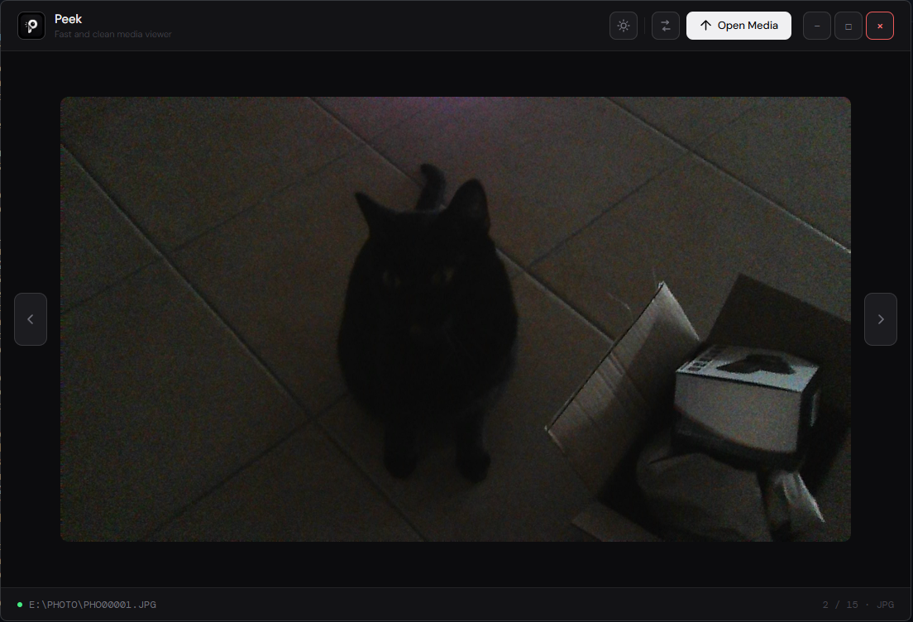
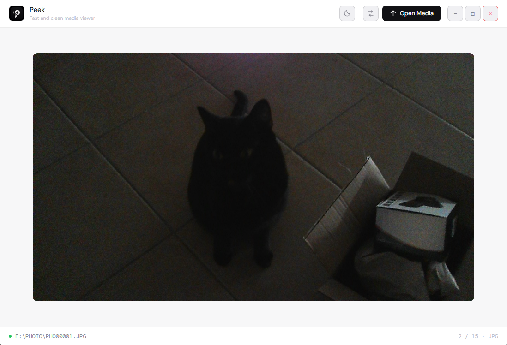

<p align="center">
  
</p>

<h1 align="center">Peek</h1>

<p align="center">
  Fast and modern media viewer built with Electron.
  Peek is a lightweight desktop app focused on clean UI, smooth media viewing and built-in format conversion powered by FFmpeg.
</p>


### A modern alternative to your default photo and video viewer 😉

---

## Features

* Modern minimal UI
* Image viewer
* Video player with custom controls
* Drag & drop support
* Folder files navigation
* Dark / Light theme
* Built-in media format converter
* FFmpeg video conversion
* Image format conversion
* Fullscreen support
* Smooth animations and transitions

---

## Supported Formats

### Images

* JPG
* JPEG
* PNG
* WEBP
* BMP
* GIF

### Videos

* MP4
* WEBM
* AVI
* MOV
* MKV

---

## Screenshots






---

## Requirements

- Node.js
- FFmpeg

---

## Installation

### Download the latest release

Download the latest installer from the Releases section.

### Install Peek

```bash
Run "Peek Setup 1.0.0.exe"
```

## Alternative installation

### Clone repository

```bash
git clone https://github.com/RicardoChambel/Peek.git
cd Peek
```

### Install dependencies

```bash
npm install
```

### Run app

```bash
npm start
```

---

## Built With

* Electron
* JavaScript
* HTML5
* CSS3
* FFmpeg

---

## License

MIT License
